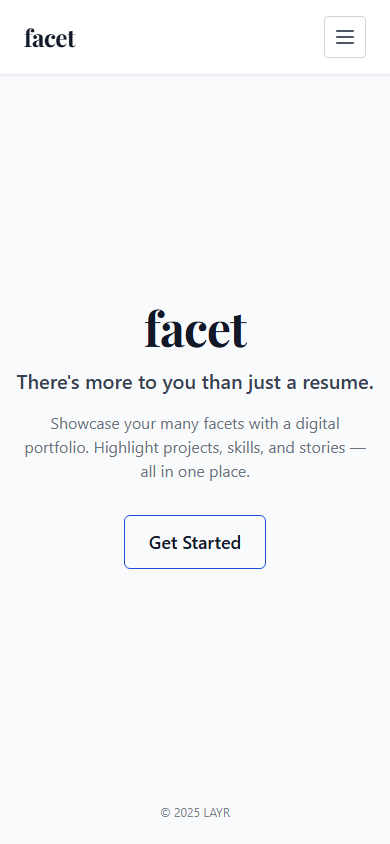
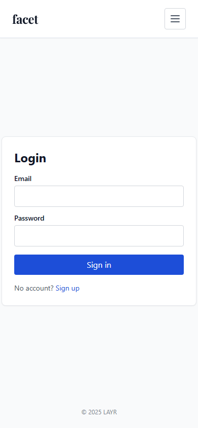
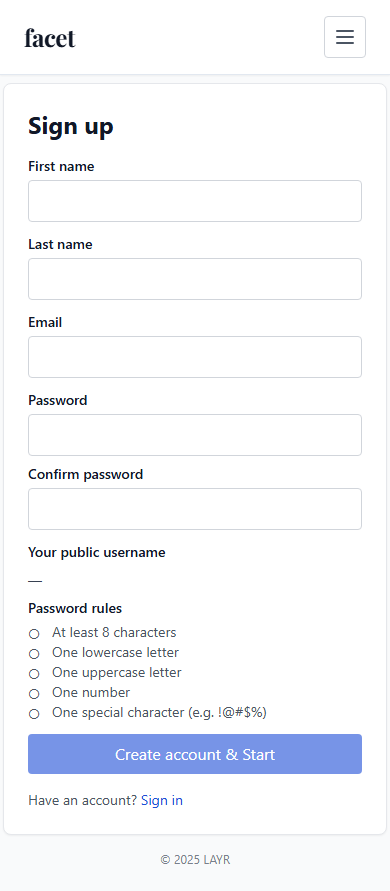

# Design

This page collects the primary UI screens and design assets for Portfolio Builder. Each image below is a simplified, high‑level mock used to communicate layout and intent. Click a screen to open the larger SVG mock.

## Screens

### Home / Landing

A welcoming landing page that presents the site wordmark, a short value proposition, and primary CTAs (Sign up / Login). This page is captured by the anonymous exporter and represents the public-facing entry point to the app.

### Login

The Login screen provides email/password authentication. The anonymous export captures the public login page; authenticated dashboards require running the authenticated exporter or signing in manually before capture.

### Signup

The Signup page collects basic account information and starts the onboarding flow (name, email, password). This page is included in the anonymous screenshot export.

## Related pages

- `Personas.md` — user profiles and goals that informed these designs
- `User Stories.md` — prioritized stories mapped to the screens above

## Color palette

- Primary teal: `#0ea5a4` — brand/background for the wordmark block and primary actions.
- Accent dark: `#0f172a` — headings and primary text on light backgrounds.
- Muted gray: `#6b7280` — secondary text and helper copy.
- White: `#ffffff` — cards and iconography foreground.

These colors are used in the mock SVGs under `wiki/design/`.

## Navigation & flows

- Primary nav locations: top-left wordmark (home) and user menu (login/signup when unauthenticated).

Core flow examples (high level):

- New visitor: Home → Sign up → Dashboard
- Returning user: Home → Login → Dashboard

Authenticated-only screens (Editor, Dashboard, Profile) are not captured by the anonymous exporter and are omitted from this page.

## Widget inventory (quick)

- Create / New Project button (Dashboard)
- Template selector (Dashboard)
- Content blocks: Text, Image gallery, Embed, Code Snippet (Editor)
- Drag handle / reorder control (Editor)
- Publish / Unpublish toggle (Editor)
- Share / Copy link (Public profile)
- Billing / Subscription controls (Dashboard)
- Invite / Team management (Dashboard)
