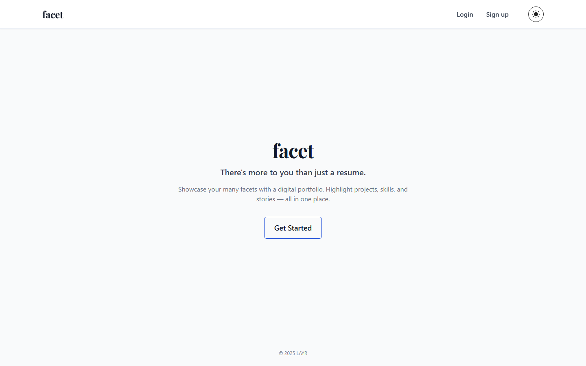
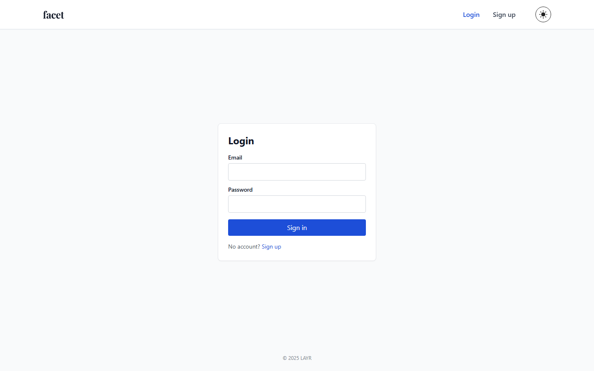
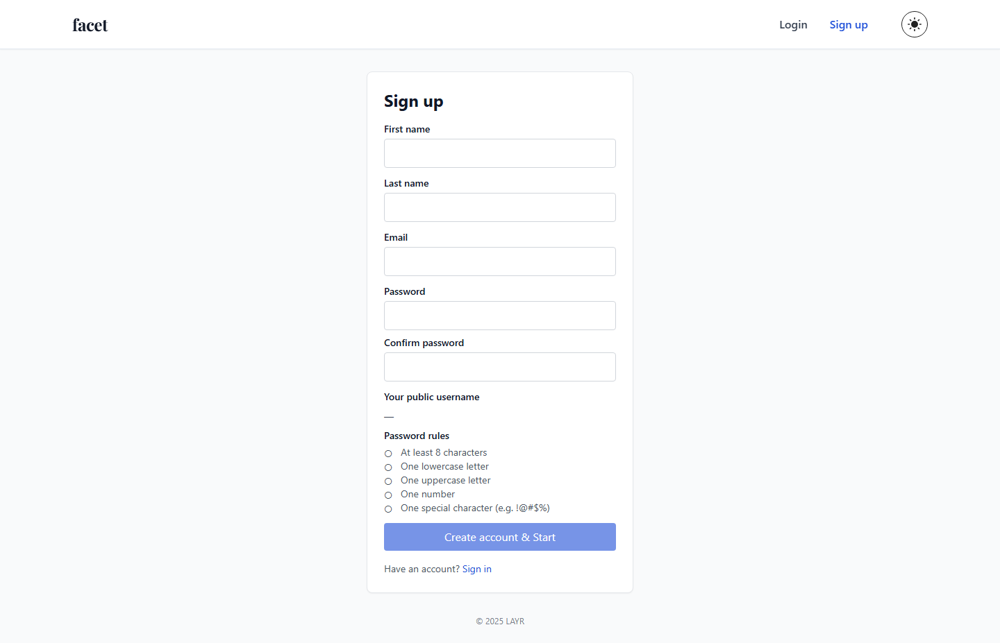
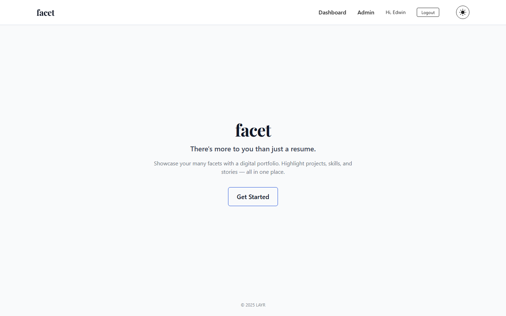
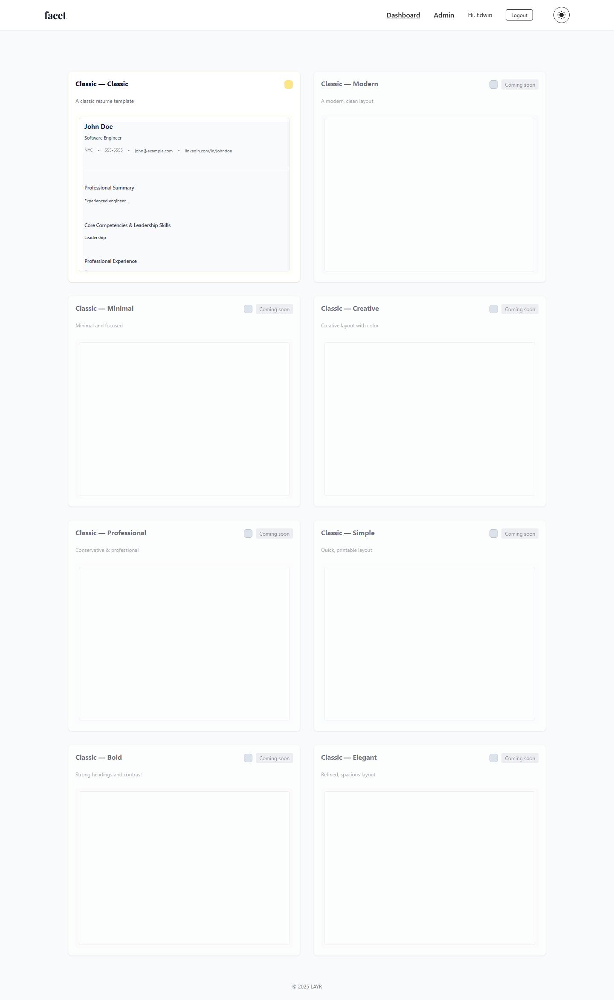
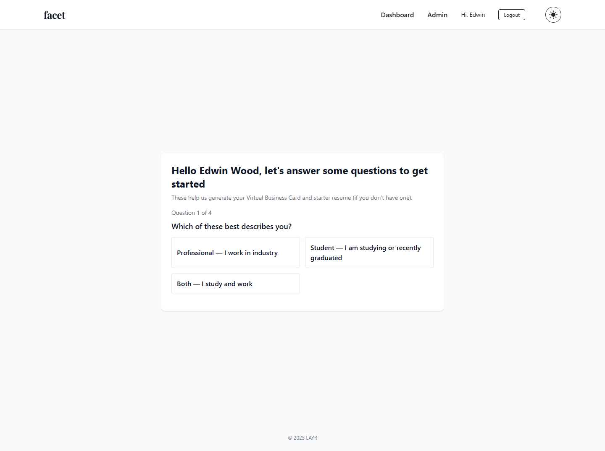
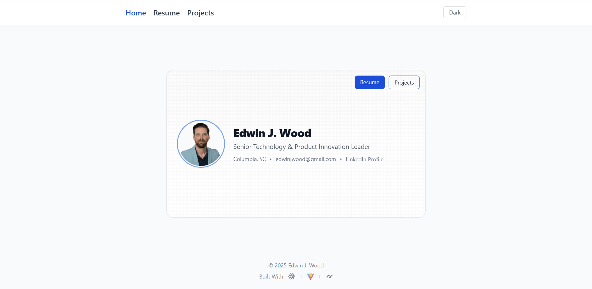
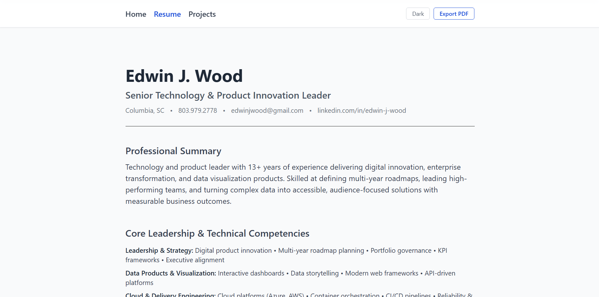

# Design — Desktop screenshots

This page collects the desktop screenshots captured from the running dev environment. The exports include both anonymous (public) and authenticated (owner) views; this page intentionally shows only the desktop captures. All screenshots were also uploaded to the project's Figma file for centralized review (see team Figma workspace for the exact file).

Paths

- Desktop screenshots (anonymous): `wiki/design/screenshots/*.png` (files with `-anon` in the name)
- Desktop screenshots (authenticated): `wiki/design/screenshots/auth/*.png` (files with `-auth` in the name)

Usage note

- The exporter script `scripts/export-screenshots-auth.cjs` captures both desktop and mobile viewports. The gallery below embeds the desktop images only.

## App color scheme

This section documents the primary color tokens used across the app UI, plus a few secondary/supporting colors and accessibility notes.


Tokens (recommended CSS variables / design tokens)

- `--color-primary`: `#0ea5a4` — Teal (primary actions, brand)
- `--color-primary-700`: `#0b7f7d` — Darker teal for emphasis
- `--color-accent`: `#06b6d4` — Accent / highlights
- `--color-bg`: `#ffffff` — Page background
- `--color-surface`: `#f8fafc` — Card / surface background
- `--color-text`: `#0f172a` — Primary text
- `--color-muted`: `#6b7280` — Secondary text
- `--color-success`: `#10b981` — Success
- `--color-warning`: `#f59e0b` — Warning
- `--color-danger`: `#ef4444` — Error / destructive

Usage guidance

- Primary buttons and key CTAs should use `--color-primary` with white text.
- Use `--color-surface` for card backgrounds to keep a subtle separation from `--color-bg`.
- Reserve `--color-accent` for small highlights, links, and tag pills.
- Ensure text contrast meets WCAG AA for normal text (>= 4.5:1). Use `--color-text` on light surfaces and white text on `--color-primary`.

Accessibility check

- Test key screens with the site's theme toggles (if any) and verify focus outlines remain visible. If a dark mode is introduced later, pick token values that maintain contrast parity.

Design tokens in code

- Example (CSS variables):

```css
:root {
  --color-primary: #0ea5a4;
  --color-primary-700: #0b7f7d;
  --color-accent: #06b6d4;
  --color-bg: #ffffff;
  --color-surface: #f8fafc;
  --color-text: #0f172a;
  --color-muted: #6b7280;
  --color-success: #10b981;
  --color-warning: #f59e0b;
  --color-danger: #ef4444;
}
```

These tokens match the project's Tailwind setup where appropriate (e.g., `theme.colors.teal` / `theme.colors.cyan`). If you want, I can add a small `wiki/design/colors.png` poster or a CSS snippet referenced by the README.

---

## Anonymous (public) screens — desktop

These screens represent the public-facing entry points and flows that any visitor sees without signing in.

### Home / Landing



A welcoming landing page that presents the app wordmark, a short value proposition, and primary CTAs (Sign up / Login). The purpose is to quickly communicate value and direct new visitors into the signup flow or returning users to the login page.

### Login



The public login screen for returning users. It contains email/password fields and a prominent CTA. This screen is captured anonymously to show the unauthenticated state and the initial access point for account owners.

### Signup



The signup page collects minimal account information and directs the user into onboarding. The goal is low friction sign-up and a clear path to creating a first portfolio.

---

## Authenticated (owner) screens — desktop

These captures were taken after programmatic login and show owner-only UI: the dashboard, editor, profile, onboarding flows and a sample portfolio page.

### Home (authenticated)



Authenticated home shows the user's primary actions, recent projects, and quick access to editor and profile links. This view emphasizes the signed-in state and available owner controls.

### Dashboard



The Dashboard aggregates projects, drafts, and high-level actions (create new, manage templates). This screenshot illustrates the information density and primary callouts for the owner's workflow.

settings). This screen highlights the fields that influence the generated homecard and public profile.

### Onboarding (starter flows)



The onboarding start screen where owners configure basics (name, role, quick choices). This flow is optimised to get a minimal portfolio and homecard created quickly.

### Portfolio (sample)




A sample portfolio page showing the published public view. This capture is useful for validating the public-facing layout after edits made in the Editor.

---

Figma

- All screenshots in this gallery have been uploaded to the project Figma file for design review and annotations.
