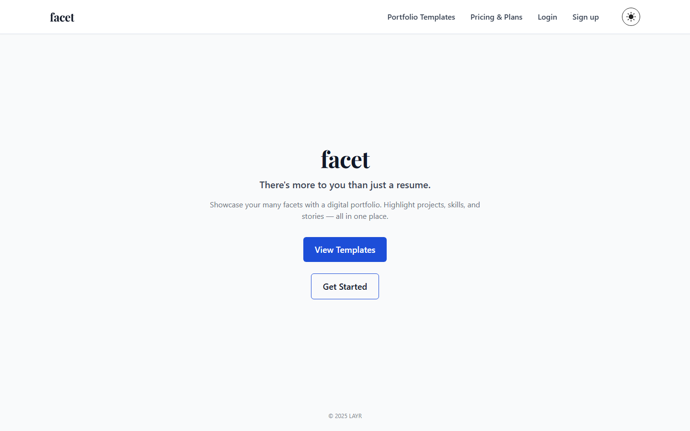
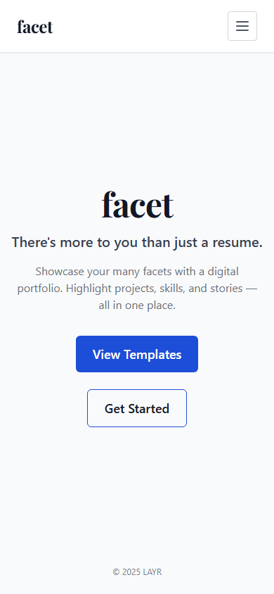
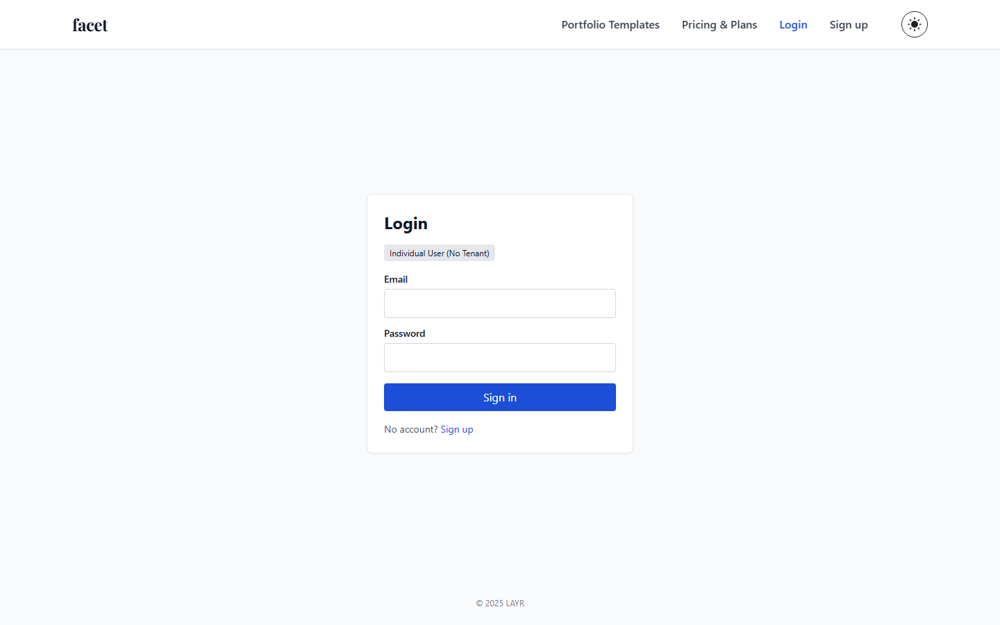
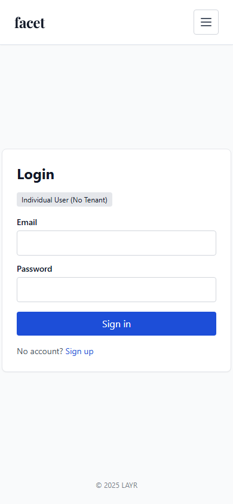
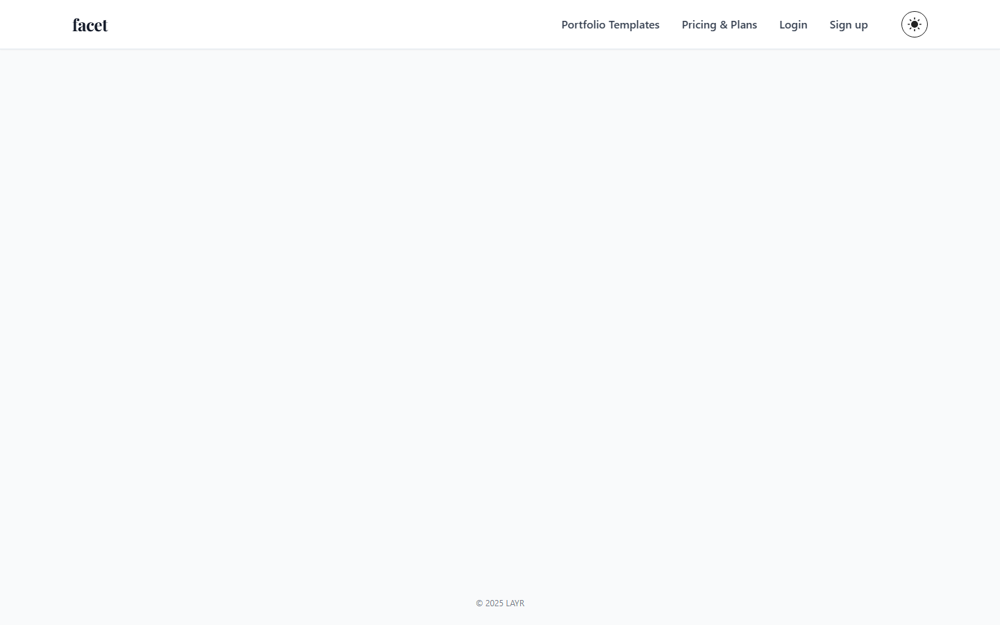
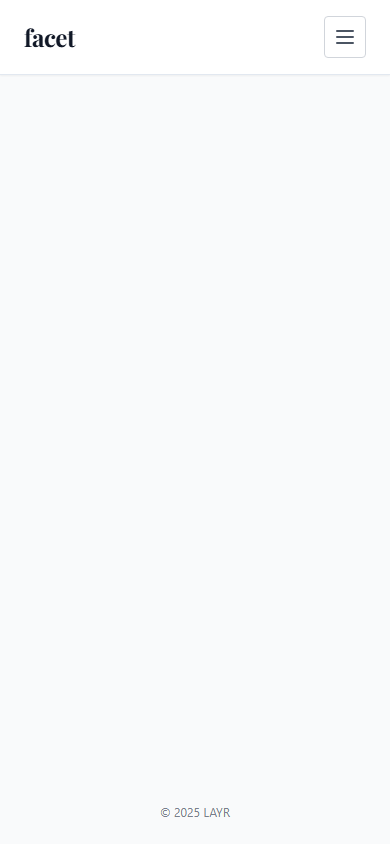

# Design

This page collects the primary UI screens and design assets for Portfolio Builder. Each image below is a simplified, high‑level mock used to communicate layout and intent. Click a screen to open the larger SVG mock.

## Screens

### Home / Landing

A welcoming landing page that presents the "facet" wordmark, short value proposition ("There's more to you than a resume"), and CTAs to create a portfolio or explore templates. The left card area highlights featured projects; the right column contains social proof and quick start actions.

### Login

The Dashboard gives users quick access to templates, recent activity, billing, and quick actions (create new portfolio, invite team). The left rail contains navigation and template shortcuts; the main area shows recent projects and activity.

> Note: the current `dashboard` screenshots were captured from an unauthenticated session and show the login screen. To capture the real Dashboard you must export with an authenticated session (see `scripts/README-EXPORT.md` for an example of how to add login steps to the Playwright exporter) or manually sign-in in a browser and capture the page.

### Editor

The Editor is a WYSIWYG-like interface for adding and reordering content blocks (text, image gallery, embeds). The left column lists blocks and settings; the right column previews the live public profile.

### Public profile / Portfolio

The public profile displays the user's projects, bio, and contact information. It supports social sharing metadata and a simple purchase/donation button powered by Stripe Checkout when enabled.

## Related pages

- `Personas.md` — user profiles and goals that informed these designs
- `User Stories.md` — prioritized stories mapped to the screens above

## Color palette

- Primary teal: `#0ea5a4` — brand/background for the wordmark block and primary actions.
- Accent dark: `#0f172a` — headings and primary text on light backgrounds.
- Muted gray: `#6b7280` — secondary text and helper copy.
- White: `#ffffff` — cards and iconography foreground.

These colors are used in the mock SVGs under `wiki/design/`.

## Navigation & flows

- Primary nav locations: top-left wordmark (home), left rail (Dashboard / Templates / Projects), user menu (profile, billing), and page-level CTAs (Create, Publish).
-- Core flow examples:
	- New user: Home → Create Portfolio → Editor → Publish → Public profile
	- Returning user: Dashboard → Open Project → Edit → Publish

These flows correspond to the screens above and are the most frequently used paths in the app.

## Widget inventory (quick)

- Create / New Project button (Dashboard)
- Template selector (Dashboard)
- Content blocks: Text, Image gallery, Embed, Code Snippet (Editor)
- Drag handle / reorder control (Editor)
- Publish / Unpublish toggle (Editor)
- Share / Copy link (Public profile)
- Billing / Subscription controls (Dashboard)
- Invite / Team management (Dashboard)
